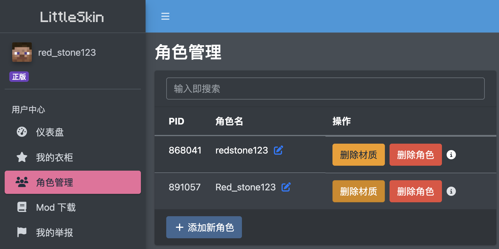
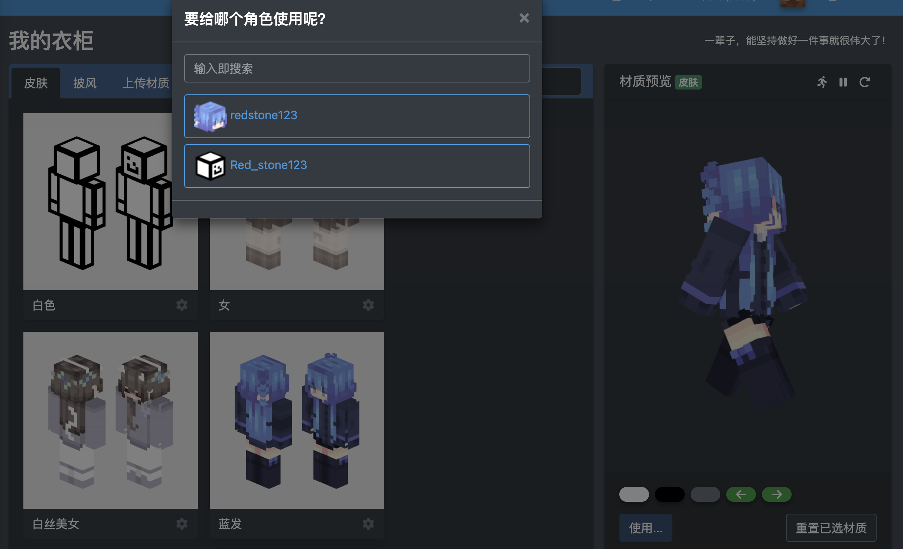
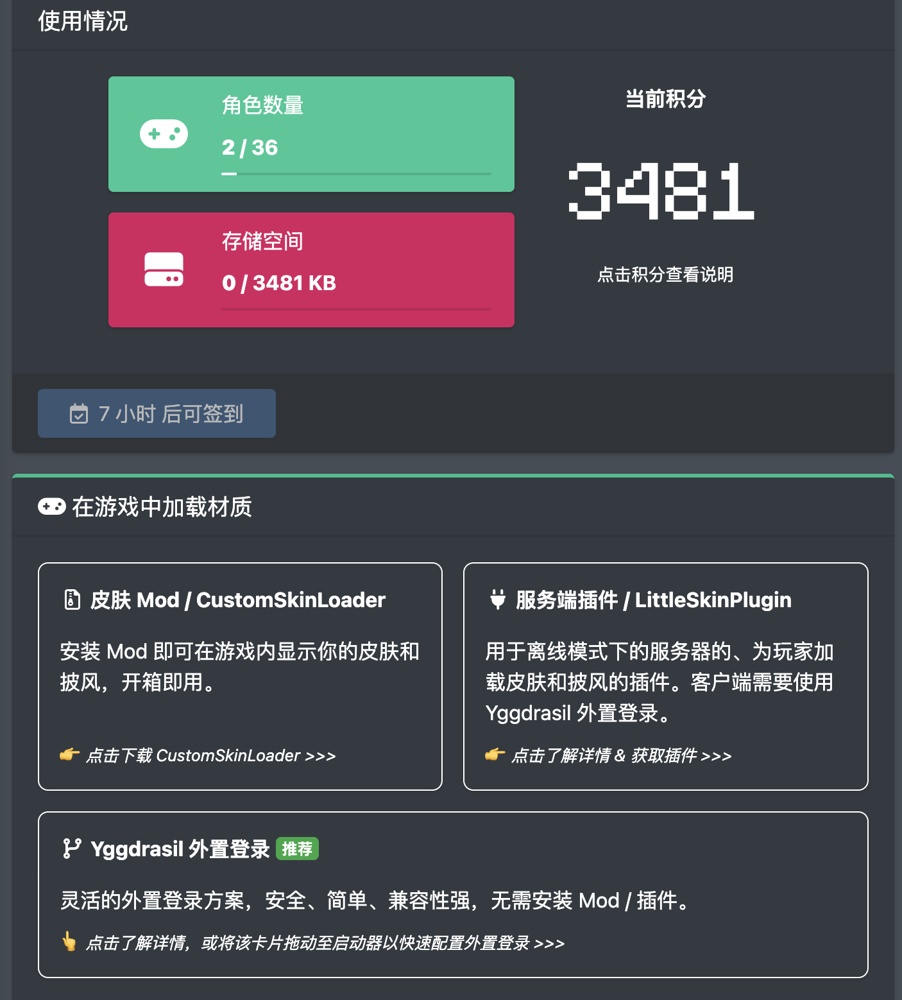
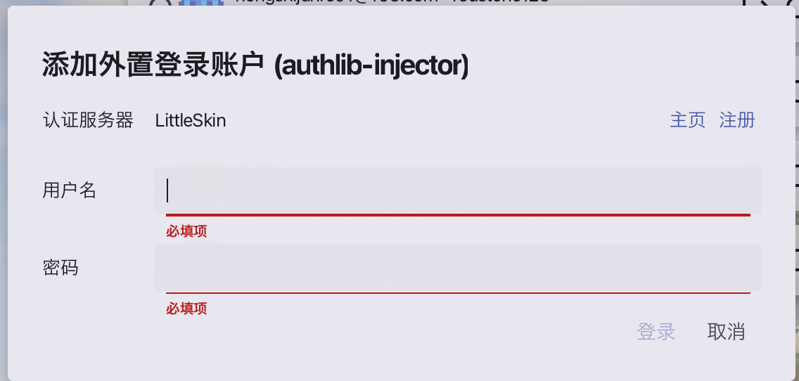

### 什么是LittleSkin?
LittleSkin是一种外置登录方式, 也是一个皮肤站. 本服务器启用了MultiLogin, 所以可以使用LittleSkin和正版进行玩家验证(但是不支持离线登录哦).
### 注册
打开[LittkeSkin官网](https://littleskin.cn/), 点注册, 填入你的信息即可.(注意密码别忘了, 后面要用)

登录在右上角.
### 添加角色

登录进去左边点角色管理-添加新角色, 然后输入角色名创建.
### 更换皮肤
在皮肤库里有现成的, 当然也可以导入自己的.

总之添加至衣柜.

点那个使用, 应用在你要应用的材质.
### 导入启动器

在仪表盘, 右边, 看到这个**Yggdrasil外置登录**了吗, 把它拖到你的启动器里.(上面有个签到, 可以顺便签一下)

或是**添加认证服务器**, 链接输入`littleskin.cn`导入外置登录方式.

然后点那个外置登录方式(在左边一栏). 输入你的邮箱和密码, 选择你要导入的账号.

然后选择你要用的账号, 启动, 进入服务器就好啦.